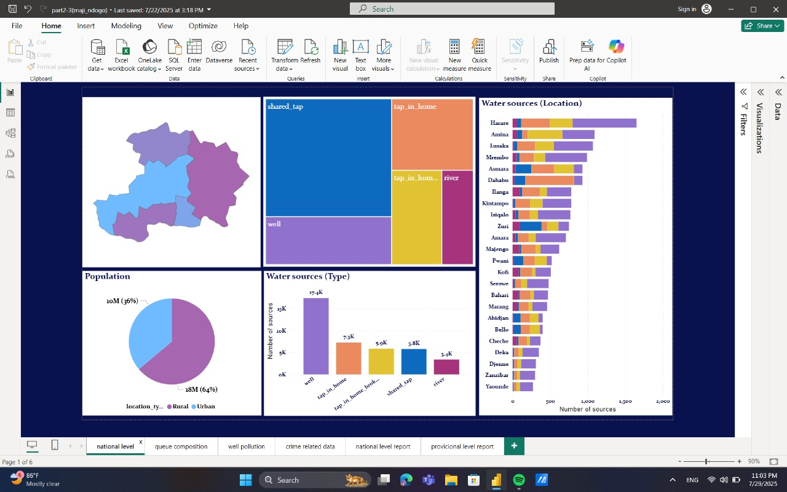
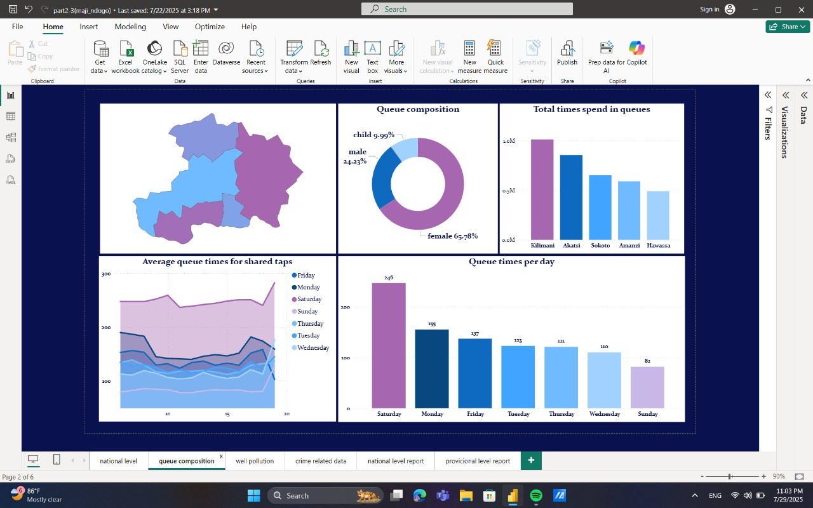
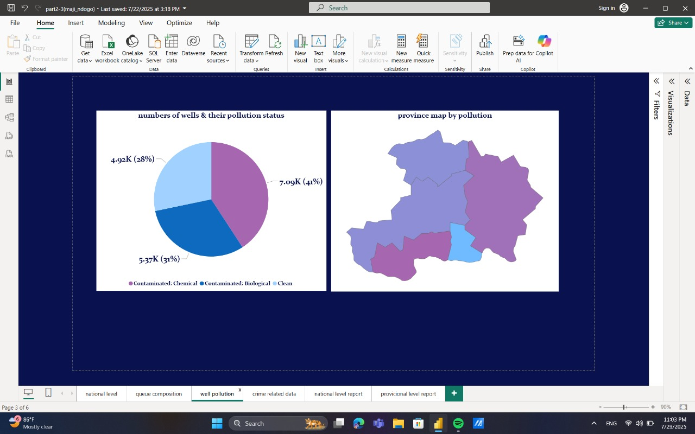
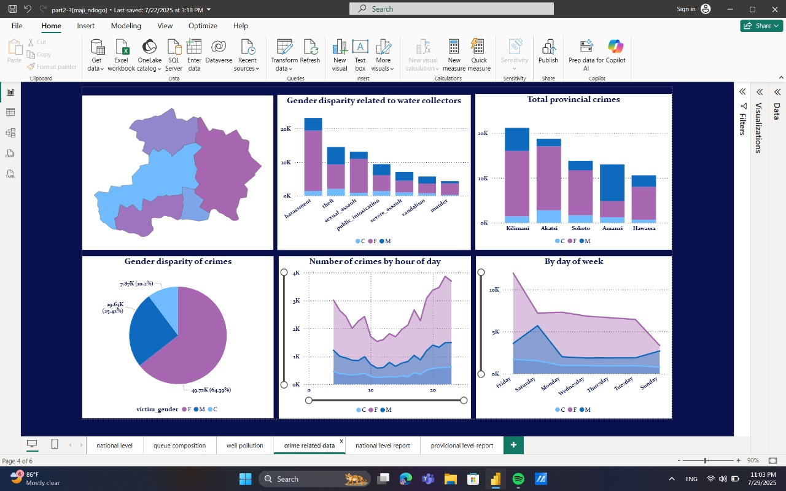

# Power BI Sprint – ALX: Maji Ndogo Dashboard (Part 2)

This project is the second part of the ALX Power BI Sprint, focused on analyzing the fictional city of **Maji Ndogo** to uncover problems related to:

- Water source accessibility  
- Queue duration & gender burden  
- Water pollution levels  
- Safety & crime near water sources  

##  Dataset

Multi-sheet Excel file containing:

- Water source data (location, source type, urban/rural)
- Queue time per hour/day
- Well contamination status
- Crime records by type, time, and victim gender

##  Report Pages

1. **National Level**  
   Overview of source distribution and population reach.

2. **Queue Composition**  
   Queue duration by weekday, gender & child impact.

3. **Well Pollution**  
   Contaminated sources by province and source type.

4. **Crime Related Data**  
   Visualizing safety risks during water collection.

##  Techniques

- Star schema model
- Many-to-many joins
- DAX Measures & calculated columns
- Interactive visuals (Map, Pie, Line, Clustered Bar)

---

##  Files in Repository
-  [Power BI Report (.pbix)](part1(maji_ndogo).pbix)
-  [Dataset (.csv)](Md_summary.csv)
-  [GeoJSON Map](MD_Provinces.json)
-  [ALX Project Brief](Part_1.pdf)
-  [Sprint Weekly Test](Answer-Maji-Ndogo-part-1-MCQ.pdf)

---

##  External Link

-LinkedIn project write-up:[www.linkedin.com/feed/update/urn:li:activity:7354059199359713280/]

---

##  Tools

- Power BI Desktop  
- Power Query  
- GeoJSON Map  
- CSV file 

---

## Report Screenshots

